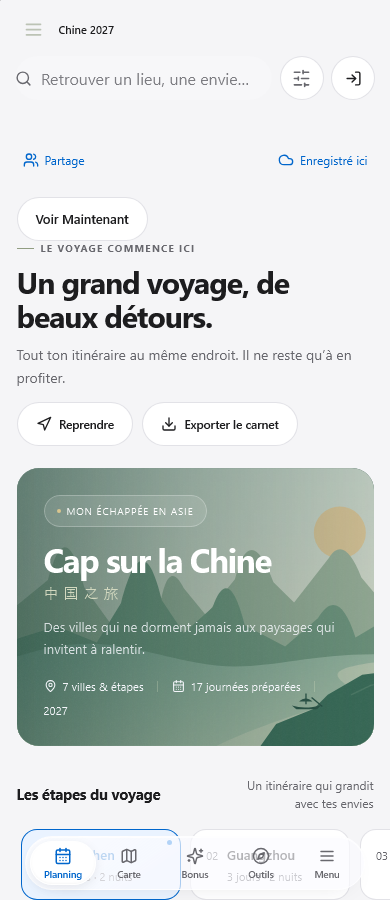
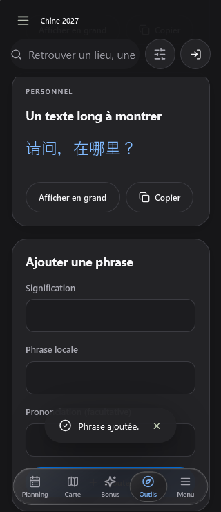

# Corrections mobiles — 10 octobre 2026

Branche : `codex/corrections-mobile`, issue de `codex/carnets-universels` après récupération fast-forward. État initial propre, révision `9fa03b15c6dfeba7129b11df538edba1ea9d0a94`. Aucune donnée personnelle utilisée : profils Playwright jetables avec modèle Chine et comptes simulés.

Appareil indiqué par le propriétaire : iPhone 17 Pro, iOS 27, Safari **et** application ajoutée à l’écran d’accueil. Cet appareil n’est pas accessible depuis cette session.

Le manifeste de la bêta stable consulté au début du diagnostic porte l’identité `55e95def53288cf0954659f44b2bab3a677130d3ad5c6515471b4be8d15b5f82`. Cela identifie le serveur à cet instant, pas le cache du téléphone. Aucune publication, fusion ou migration distante n’est effectuée par cette tâche.

## Diagnostic et changements

| Point | Preuve avant / cause établie | Correction et portée |
| --- | --- | --- |
| Largeur / focus | La police calculée du pense-bête mesure 15 px à 320 px. La règle mobile de 16 px ne couvre que les descendants de `.field`, et certaines surcharges ont une spécificité supérieure. Le zoom automatique et le tremblement physiques ne sont pas reproduits. | Tous les champs de saisie mobiles passent à 16 px, y compris recherche, notes et sélecteurs. Les champs temporels rétrécissent dans leur colonne. Le zoom volontaire reste autorisé. Aucun masquage global de débordement ajouté. |
| Dates | Chromium mesure 2 px de différence entre thème et date dans « Nouvelle journée ». Les contrôles natifs n’ont pas de hauteur explicite commune. | Contrôles de formulaire sur une ligne et dates/heures à 48 px, largeur bornée à leur colonne, bordure/police cohérentes. Le type natif et les contraintes de valeurs restent en place. Inventaire : journée, préparation, voyages, Maintenant, hébergements, transports/réservations, budget, vue d’ensemble, ancien séjour. |
| Bonus | Le clic remplace systématiquement la catégorie par son identifiant ; les boutons n’exposent pas `aria-pressed`. Échec comportemental initial enregistré. | Retoucher la catégorie active revient à toutes ; passer à une autre remplace la catégorie. Favoris indépendant ; état accessible et activation clavier testés. |
| Phrases | La grille et le formulaire d’ajout sont des frères sans marge entre eux dans le code initial. | Marge de 18 px, identique à l’espacement de la grille ; ajout réel et thème sombre testés. |
| Zone supérieure | Les en-têtes possèdent déjà la marge système et les couleurs de thème correctes. Le menu latéral a une marge fixe. Une simulation de découpe à 59 px a révélé une surcharge CSS annulant sa marge. | Marge du menu basée sur `safe-area-inset-*`, avec spécificité suffisante. Fond opaque limité à la marge système des en-têtes pour éviter que le contenu défilant transparaisse sous la découpe. Aucun pixel propre à un modèle dans le produit ; 59 px est uniquement une fixture de test. |
| Collaboration | Une grande section présente en tête de chaque vue contient participants, statut, explications et actions. | Deux entrées dans le menu existant ; résumé uniquement sur Planning et signal direct en cas de conflit/erreur/droits modifiés sur les autres vues. Détails et actions dans les panneaux. Une seule instance de `TripCollaboration` reste montée ; boutons de menu rendus par portail, timers existants conservés. Accueil global réduit à un statut et ses actions utiles. |
| Retour de focus | WebKit a révélé que fermer un panneau pouvait rendre le focus au bouton du menu devenu invisible. Le header est encore `inert` au moment où le menu se ferme. | Cible de retour explicite vers le bouton d’ouverture du menu mobile ; restauration sans déplacement du défilement. Si un panneau de détails est remplacé par les actions de partage, un accès visible remplace le déclencheur retiré du DOM. Un test dédié a reproduit puis couvre ce cas. |

La saisie conserve le même champ React et le même mécanisme de sauvegarde. Aucun changement du stockage, du moteur de synchronisation, des RPC ou des permissions serveur.

## Vérification

WebKit : **10 tests réussis** sur la suite complète, puis **3 tests ciblés réussis** après le dernier ajustement de focus (dont le nouveau parcours détails → actions → fermeture), avec les quatre langues à 320/390/430/1440 px, filtres clavier/favoris, dates journée/hébergement, phrases, retour de focus, saisie prolongée hors ligne et safe area simulée. Les captures ont été relues visuellement.

Gate final : **19/19 étapes réussies**, aucun contrôle arrêté/non exécuté, source inchangée pendant la passe. Types produit/tests/configurations, lint, **104 tests unitaires**, **70 tests Chromium retenus**, build, manifeste/intégrité, SQL L6 et **neuf smokes compilés** ont réussi. Identité du build de validation : `22c13f3d90b75807493165ace1ef0b97ad8a2cf6a6c4cf8cd7cad24322271660`. Il utilise des paramètres Supabase factices et ne constitue pas un candidat à publier.

Premier gate : **13 étapes réussies, 1 échec, 5 non exécutées** ([rapport conservé](mobile/validation-first-attempt.json)). Types, lint, 104 tests unitaires, 69 tests Chromium, SQL, build, production/hors ligne, restauration et smoke UI sont passés. Le scénario de partage échouait lors d’une réouverture avant la fin de fermeture animée d’un panneau. Le test attend maintenant sa disparition effective, sans délai arbitraire. Sa relance isolée a réussi avec les trois profils et les invariants serveur simulés.

Un défaut de retour de focus pendant le passage détails → actions de partage a également été reproduit par un nouveau test et corrigé. La passe ciblée WebKit est réussie. Le **second gate complet est réussi**, y compris les cinq contrôles qui n’avaient pas été exécutés au premier essai. Le partage compilé vérifie trois profils créateur/éditeur/lecteur, invitations, droits individuels, conflit hors ligne avec copies conservées, révocation, annulation/confirmation du départ et réinvitation. Les smokes vérifient aussi la fermeture complète puis réouverture de Chrome hors ligne, les préférences, Maintenant et la préparation des journées.

[Rapport final du gate](mobile/validation-local.json). Empreinte source : `9a5f347675677c5af8473ddfb48b3bb0d351b110b603bc2da64427e6b87c599f`. Les captures complémentaires du gate sont conservées dans `C:\Users\eliot\AppData\Local\Temp\detours-verify-SqrOp2` (profils et backend simulés). Le build de validation n’est pas publié.

`git diff --check` réussit. Les contrôles réseau Supabase/taux, OAuth Google réel, suite Playwright complète au-delà des sélections du gate et essais physiques n’ont pas été exécutés.

## Fichiers modifiés

- Produit : `src/App.tsx`, `src/apple-design.css`, `src/components/JourneysApp.tsx`, `src/components/PracticalView.tsx`, `src/components/TripCollaboration.tsx`, `src/locales/beta.ts`.
- Vérification : `tests/e2e/mobile-corrections.spec.ts`, `tests/e2e/l4-status.spec.ts`, `playwright.mobile.config.ts`, `scripts/verify-local.mjs`, `scripts/smoke-common-sharing.mjs`.
- Suivi : `PLAN-CORRECTIONS-MOBILE.md`, ce rapport, deux captures et les rapports JSON dans `docs/development/mobile/`.

Tests ajoutés : `tests/e2e/mobile-corrections.spec.ts`. WebKit : `npx playwright test --config playwright.mobile.config.ts`. Le gate Chromium inclut désormais cette suite et les contrôles d’en-tête existants.

Les premières passes ont révélé des erreurs de sélecteurs dans les nouveaux tests (bouton Bonus contenant un compteur, plusieurs boutons d’hébergement, mauvais onglet pour les phrases). Une attente explicite du montage du voyage a aussi corrigé une course de démarrage du test dans WebKit. Ces erreurs ont été corrigées ; elles ne sont pas des défauts produit.

## Recette sur l’iPhone

Après une publication séparément autorisée, identifier `build-info.json` et vérifier l’activation du nouveau service worker. Effectuer le même parcours dans Safari puis depuis l’icône installée, sur carnet factice :

1. Clair, sombre puis automatique : accueil, planning, menu, défilement sous la Dynamic Island ; portrait et paysage, barre Safari déployée/rétractée.
2. Nouvelle journée : date vide puis remplie, thème/date de même hauteur, calendrier natif utilisable. Hébergement : arrivée/départ, refus d’un départ antérieur à l’arrivée. Vérifier aussi les autres dates.
3. Pense-bête et notes du carnet : au moins 30 secondes de frappe, retours à la ligne, déplacement du curseur, sélection/collage, effacement, clavier fermé/réouvert, conservation après rechargement ; refaire hors ligne et pendant un envoi.
4. Bonus : activer/désactiver A, passer A → B, puis refaire avec favoris. Aucun favori perdu.
5. Phrases : vérifier l’espace avant l’ajout avec zéro, une et plusieurs phrases, puis ajouter une phrase multiligne.
6. Depuis chaque vue : menu → Partage ou Synchronisation en deux actions ; participants/rôles, copie lecteur, relance, conflit et départ accessibles selon les droits. Fermeture et retour de focus cohérents.
7. Focus, double toucher, pincement volontaire et texte agrandi : conserver l’accessibilité ; après retour à l’échelle normale, vérifier les marges, la position du curseur et l’absence d’oscillation ou de déplacement latéral.

Un succès en Chromium/WebKit sur PC ne valide ni clavier iOS, ni pincement réel, ni Dynamic Island, ni le mode installé sur cet iPhone. OAuth et comptes distants réels restent hors couverture.
